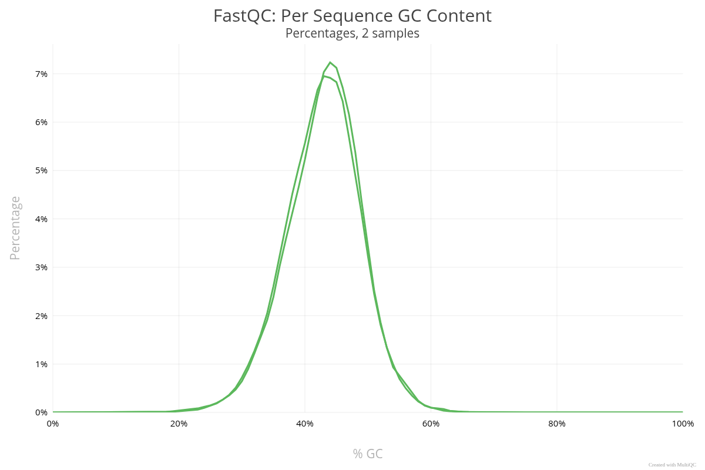
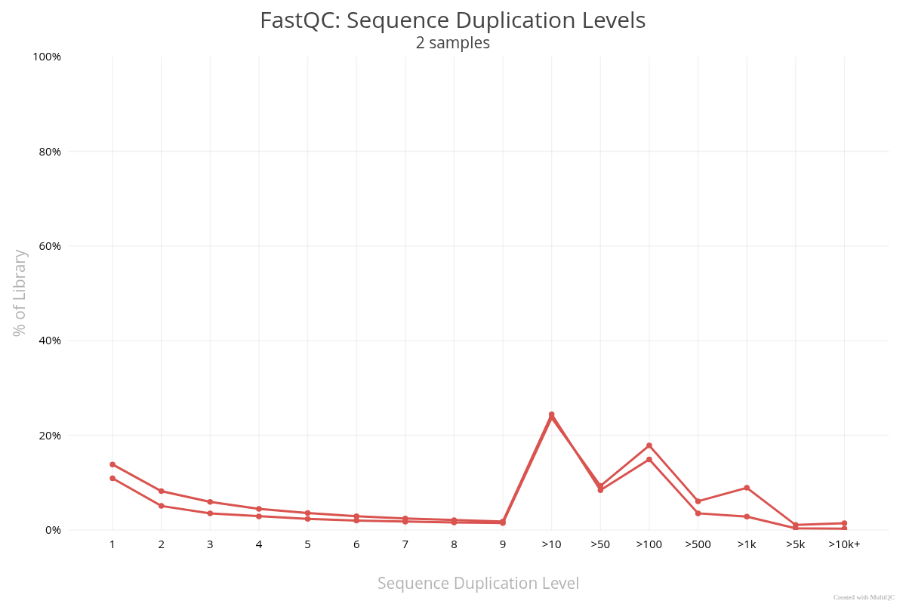
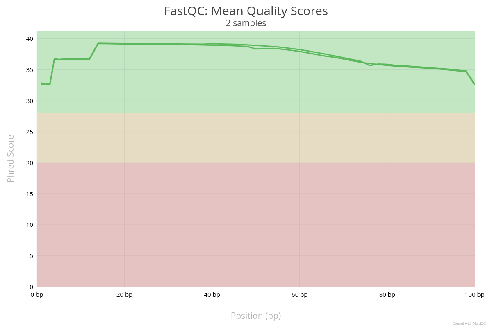
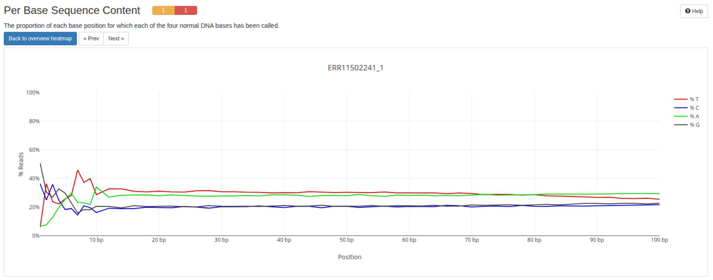
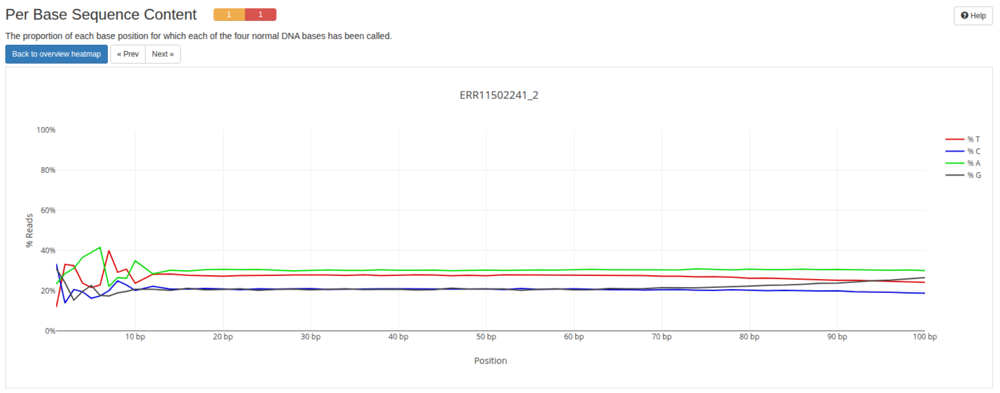
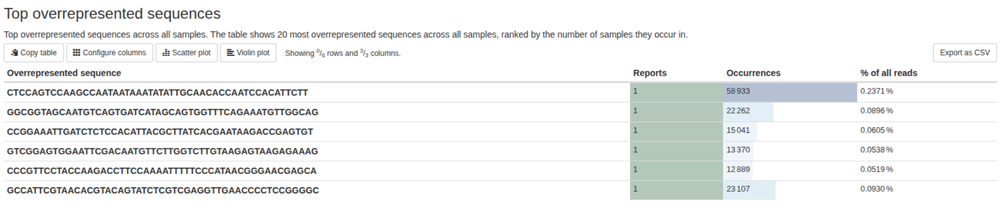
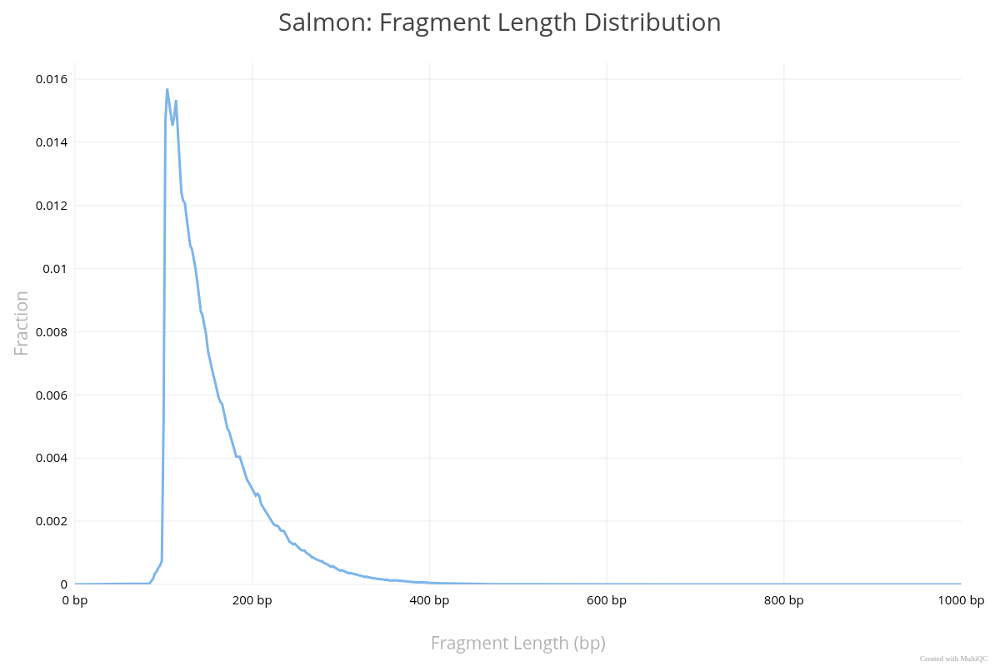

The pipeline was run on the default test data with conda and docker profiles.

ERR11502241 sequncing run was chosen for testing on real data. It contains RNA-seq data from Saccharomyces cerevisiae (brewer's yeast) model organism. Enterez transcriptome was used as the reference.
To generate analysis results the pipline was run with the follwing arguments:
```
$ nextflow run nextflow-io/rnaseq-nf \
    -profile docker \
    --reads 'ERR11502241_{1,2}.fastq' \
    --transcriptome $PWD/Saccharomyces_cerevisiae.R64-1-1.cdna.all.fa \
    --outdir ERR11502241_results
```

## General statistics
The pipeline processed approximately 25 million reads. 
* GC Content: Observed at around 40%, which aligns with the known genomic composition of S. cerevisiae.
* Duplication rate: Relatively high. In RNA-seq, this is often expected because highly expressed genes will naturally produce many identical reads.




### FastQC metrics
* Per Base Sequence Quality: Mean Phred scores remained consistently above 30 across the full read length, indicating high base-calling accuracy (<0.1% error rate).
* Per Base Sequence Content: Characteristic divergence in nucleotide composition was observed in the initial 10-15 bp. This is consistent with non-random hexamer priming bias inherent to the Illumina library preparation protocol.
* Per Sequence GC Content: The distribution is monomodal and centered at the expected organismal mean, indicating a lack of significant adapter or bacterial contamination.
* Overrepresented Sequences: Frequent sequences identified are likely associated with highly expressed transcripts or residual ribosomal RNA, common in RNA-seq libraries.








### Salmon
* Fragment Length Distribution: The fragment length distribution shows a distinct peak between 200 bp and 300 bp. This confirms that the RNA library was not significantly degraded and that the library insert sizes are optimal for paired-end sequencing.


### Conclusion
The raw sequencing data and mapped fragments meet the quality thresholds required for reliable transcriptomic analysis.